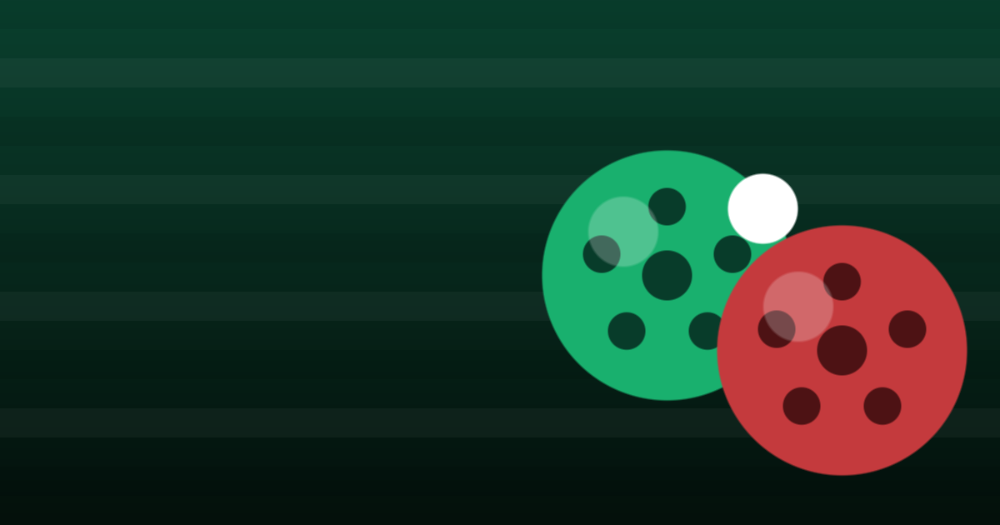

# SoccerBocce ⚽🟢🔴

**Bocce — but you kick soccer balls.** Flick yours closest to the little white
**pallina**. Score a point for every ball you land closer than your rival's best.
First to the target (7 / 12 / 16) wins the match.

A **Mikey Alessandro original** — an invented sport, now a game.



## How to play

- **Kick:** press and **drag back** from your ball, then release to fling it
  (slingshot). The dotted arc previews your line; the ring shows power.
- **Frame:** the pallina is kicked out, then teams alternate kicks. Per bocce,
  the team that is **not** currently closest kicks next, until balls run out.
- **Scoring** (your design figures): when all 8 balls are down, the closest team
  scores **1 point for every ball nearer the pallina than the opponent's nearest
  ball**. Winner of the frame starts the next.
- **Modes:** solo vs **Bocci** (AI, 3 difficulties) or **Pass & Play** on one device.

## What's inside

A single self-contained `index.html` — no framework, no build step. Pure canvas
physics (friction, wall + ball collisions, a lighter pallina), WebAudio SFX,
confetti, and an installable PWA shell. Open the file and it just runs.

```
.
├── index.html              # the entire game (canvas + logic + UI)
├── manifest.webmanifest    # PWA manifest (add-to-home-screen)
├── sw.js                   # service worker (offline; network-first HTML)
├── icons/                  # icon-192.png, icon-512.png (PWA)
├── og.png                  # 1200×630 social-share image
├── make_assets.py          # regenerates icons + og.png (stdlib only, no deps)
└── README.md
```

## Run locally

```sh
python3 -m http.server 8770
# open http://localhost:8770
```

## Regenerate art

```sh
python3 make_assets.py      # rewrites icons/*.png and og.png
```

## Publish to GitHub Pages

```sh
bash publish.sh             # commits and pushes; see the script header
```

Then in the repo: **Settings → Pages → Deploy from branch → `main` / root**.
Lives at `https://<user>.github.io/soccerbocce/`.

> Updating later? Bump `CACHE` in `sw.js` (e.g. `soccerbocce-v2`) so returning
> players get the new build. (HTML is already network-first, so most edits show
> up on next load.)

## Credits

Designed & built by [Mikey Alessandro](https://www.mikeyalessandro.com).
If you enjoy it, [buy me a coffee](https://ko-fi.com/mikeyalessandro) ☕.

MIT license. SoccerBocce game design © Mikey Alessandro.
